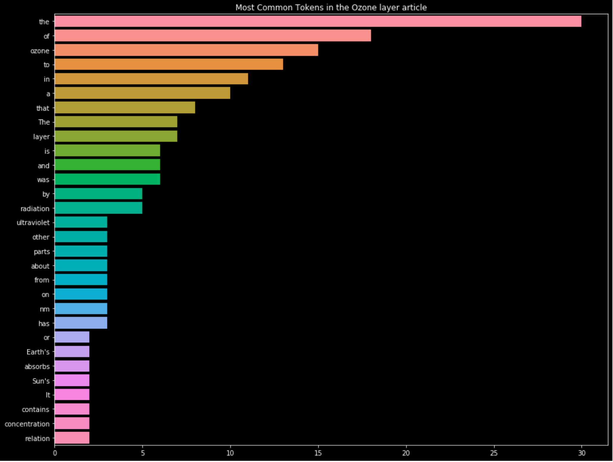

# Welcome to My Mr Clean project

## Task
- Get some article from Wikipedia to work with.
- Extract meaningful and usable content from this article.
- Clean up and filter the data to narrow the scope to relevant words
- Build a simple frequency model.
- Analysing the article based on this model.


## Description
It is time to get our hands dirty and to manipulate some real world data. You have been hired by a new company named EncyclEarthpedia and your first task it build a search engine. EncyclEarthpedia is an online encyclopedia but specialized in the planet Earth, its geology, biology, and everything related to the Earth.

The search engine should be simple at first. The user needs to be able to type some words and the engine returns the most relevant articles.

There is a problem though. The engineers working on the database messed up and EncyclEarthpedia's database and API are not available for a week. This is a bummer ! If we can't have access to the articles, how are we going to build our engine ?

Instead of waiting for a week, we are going to build a simple model for some similar article from Wikipedia.


## Installation
```commandline
https://github.com/abdullaabdukulov/02-Data-Science-My-Mr-Clean-
```
```commandline
git clone https://github.com/abdullaabdukulov/02-Data-Science-My-Mr-Clean-.git
```
```commandline
git code .
```


## Usage

